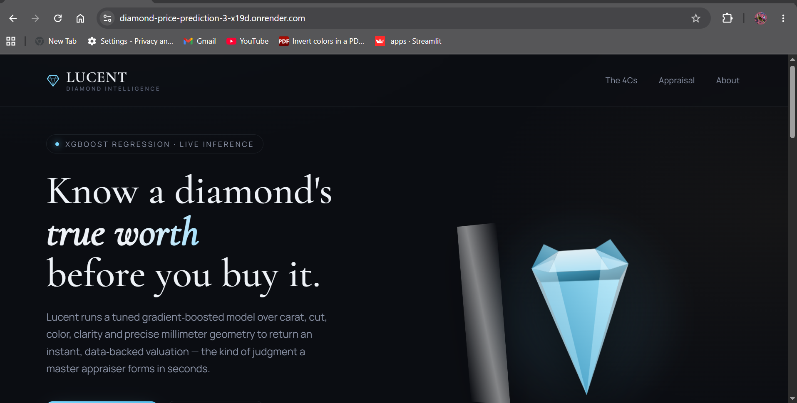
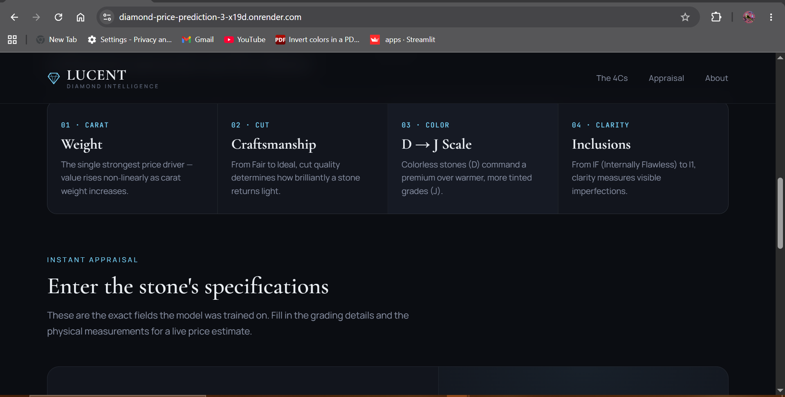
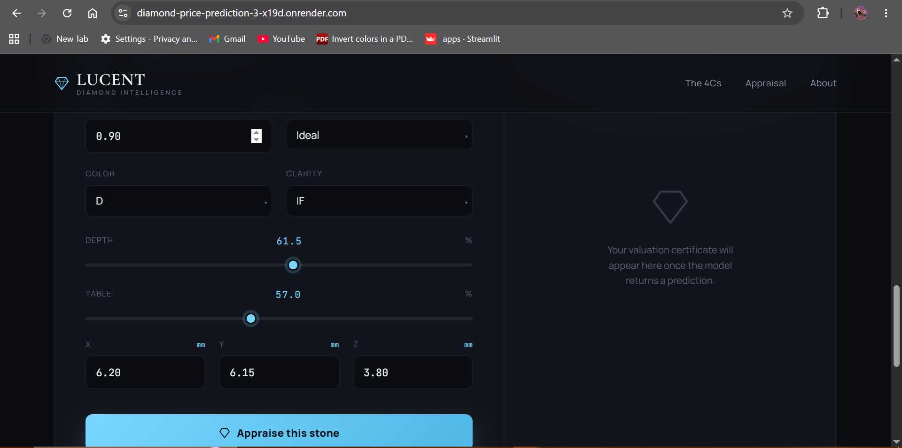

<div align="center">

# 💎 Diamond Price Prediction

### An end-to-end machine learning system that predicts diamond prices from the 4Cs and physical dimensions

[](https://diamond-price-prediction-3-x19d.onrender.com)
[](https://diamond-price-prediction-ukgk.onrender.com/docs)
[](https://www.python.org/)
[](https://fastapi.tiangolo.com/)
[](https://xgboost.readthedocs.io/)
[](https://scikit-learn.org/)
[](https://render.com/)

</div>

---

## 📖 Overview

**Diamond Price Prediction** is a full-stack machine learning application that estimates the market value of a diamond from its physical and quality attributes — carat, cut, color, clarity, depth, table, and dimensions (X, Y, Z).

The project covers the complete ML lifecycle:

- 📊 **Exploratory Data Analysis & statistical testing** on a 53,940-row diamond dataset
- 🧹 **Data cleaning** — duplicate removal, IQR-based outlier filtering, skew correction
- 🤖 **Model benchmarking** across 5 regression algorithms with 5-fold cross-validation
- 🎯 **Hyperparameter tuning** via `RandomizedSearchCV` on XGBoost
- 🚀 **Production deployment** as a REST API (FastAPI) with a live, animated frontend

**Live demo:** [diamond-price-prediction-3-x19d.onrender.com](https://diamond-price-prediction-3-x19d.onrender.com)

> ⚠️ The backend is hosted on Render's free tier — the first request after inactivity may take ~30–60 seconds to spin up.

---

## 🏗️ Architecture

```
┌─────────────────────┐         POST /predict          ┌──────────────────────┐
│                      │  ─────────────────────────────▶ │                      │
│   Frontend (HTML/JS) │        JSON: diamond specs       │   FastAPI Backend    │
│   "Lucent" UI        │                                   │   (app.py)           │
│   Hosted on Render   │  ◀───────────────────────────── │   Hosted on Render   │
│                      │        JSON: { "Price": ... }    │                      │
└──────────────────────┘                                   └──────────┬───────────┘
                                                                        │
                                                                        ▼
                                                          ┌──────────────────────────┐
                                                          │  Tuned XGBoost Pipeline  │
                                                          │  (preprocessing + model) │
                                                          │  tuned_xgboost_pipeline  │
                                                          │        .pkl              │
                                                          └──────────────────────────┘
```

---


|   |    |    |  


## ✨ Features

- **Interactive valuation UI** — a dark, jewel-toned interface ("Lucent") with live sliders, an animated 3D-style diamond, and an instant "valuation certificate" result card
- **Real-time inference** — every prediction is a live call to the deployed FastAPI `/predict` endpoint; no values are hard-coded on the frontend
- **Robust preprocessing pipeline** — log-transform + scaling for skewed numeric features, ordinal encoding for `Cut`, one-hot encoding for `Color`/`Clarity`, all bundled into a single `scikit-learn` `Pipeline`/`ColumnTransformer`
- **Tuned gradient-boosted model** — XGBoost regressor optimized with `RandomizedSearchCV` over estimators, learning rate, depth, and sampling ratios
- **Typed, validated API** — request/response schemas enforced with Pydantic, including literal-typed categorical fields (no invalid `Cut`/`Color`/`Clarity` values can reach the model)

---

## 🧠 Notebook Walkthrough — `Diamond_Price_Prediction.ipynb`

The notebook covers the full workflow from raw data to a tuned, serialized model. Below is a breakdown of every technique used, in the order it's applied.

### 1. Dataset
- **Source:** [Diamond Price Prediction Dataset](https://www.kaggle.com/datasets/ronil8/diamond-price-prediction-dataset) (Kaggle), loaded via `kagglehub`
- **Raw size:** 53,940 rows × 10 columns — `Carat(Weight of Daimond)`, `Cut(Quality)`, `Color`, `Clarity`, `Depth`, `Table`, `Price(in US dollars)`, `X(length)`, `Y(width)`, `Z(Depth)`

### 2. Data cleaning
- **Null check** — `df.isnull().sum()` confirmed no missing values
- **Duplicate removal** — `df.drop_duplicates()`
- **Outlier removal** — IQR method applied to *all* numeric columns: `Q1`, `Q3`, `IQR = Q3 - Q1`, bounds set at `Q1 - 1.5×IQR` / `Q3 + 1.5×IQR`; any row with an outlier in any numeric column was dropped

### 3. Exploratory Data Analysis (EDA)
| Technique | Purpose |
|---|---|
| `sns.countplot` | Class distribution of `Cut`, `Color`, `Clarity` |
| `sns.boxplot` | Price spread across each categorical grade |
| `sns.scatterplot` | Relationship between `Carat` and `Price` |
| `sns.kdeplot` | Price distribution shape (checked for skew) |
| `sns.heatmap` (correlation matrix) | Pairwise correlation between numeric features |
| `.skew()` | Quantified skewness of each numeric column pre- and post-transform |
| **One-way ANOVA** (`scipy.stats.f_oneway`) | Statistically tested whether `Cut`, `Color`, and `Clarity` each have a significant effect on `Price` — all three came back significant |

### 4. Feature engineering & encoding strategy
Features were split into four groups, each handled by its own transformer inside a `ColumnTransformer`:

| Group | Columns | Technique |
|---|---|---|
| **Skewed numeric** | `Carat`, `Depth`, `Y (width)`, `Z (depth)` | `FunctionTransformer(np.log1p)` → `StandardScaler` (log-transform to reduce skew, then standardize) |
| **Regular numeric** | `Table`, `X (length)` | `StandardScaler` only |
| **Ordinal categorical** | `Cut` | `OrdinalEncoder` with an explicit, domain-informed order: `Fair < Good < Very Good < Premium < Ideal` (preserves the natural quality ranking instead of treating grades as unordered) |
| **Nominal categorical** | `Color`, `Clarity` | `OneHotEncoder` (no inherent order, so one-hot avoids introducing a false ranking) |

All four transformers are combined with `sklearn.compose.ColumnTransformer` and wrapped in a single `sklearn.pipeline.Pipeline` alongside the estimator — so preprocessing and modeling are trained and serialized together as one artifact (`tuned_xgboost_pipeline.pkl`), and the exact same transformations are applied automatically at inference time in `app.py`.

```python
skew_pipeline = Pipeline([
    ('skew', FunctionTransformer(np.log1p)),
    ('scale', StandardScaler())
])
num_pipeline = Pipeline([('scale', StandardScaler())])
ordinal_pipeline = Pipeline([
    ('encoder', OrdinalEncoder(categories=[['Fair','Good','Very Good','Premium','Ideal']]))
])
cat_pipeline = Pipeline([('one-hot', OneHotEncoder())])

preprocessor = ColumnTransformer([
    ('skew', skew_pipeline, skewed_cols),
    ('num', num_pipeline, ['Table', 'X(length)']),
    ('ordinal', ordinal_pipeline, ['Cut(Quality)']),
    ('cat', cat_pipeline, ['Color', 'Clarity'])
])
```

### 5. Train/test split
`train_test_split` — 80/20 split, `random_state=42`.

### 6. Model benchmarking
Five regression algorithms were each dropped into the same `Pipeline` (preprocessor + model) and evaluated with **5-fold cross-validation** (`cross_val_score`, `scoring='r2'`) on the training set:

| Model | CV R² Score |
|---|---|
| Linear Regression | 0.925 |
| Support Vector Machine (SVR) | 0.687 |
| Decision Tree Regressor | 0.966 |
| Random Forest Regressor | 0.982 |
| **XGBoost Regressor** | **0.982** |

### 7. Hyperparameter tuning
XGBoost was selected as the production candidate and tuned with **`RandomizedSearchCV`** over the full preprocessing + model pipeline:

```python
param_dist = {
    'model__n_estimators': [100, 300, 500, 800],
    'model__learning_rate': [0.01, 0.05, 0.1, 0.2],
    'model__max_depth': [3, 5, 7, 9],
    'model__subsample': [0.6, 0.8, 1.0],
    'model__colsample_bytree': [0.6, 0.8, 1.0]
}
```

### 8. Final evaluation (held-out test set)
| Metric | Score |
|---|---|
| **R² Score** | **0.9838** |
| **Mean Absolute Error** | **$194.16** |

### 9. Serialization
The best estimator (`xgb_random_search.best_estimator_` — the full pipeline, preprocessing included) is persisted with **`joblib.dump()`**, so `app.py` only needs to `joblib.load()` it and call `.predict()` directly on raw feature input.

---

## 📂 Repository Structure

```
Diamond-Price-Prediction/
├── Diamond_Price_Prediction.ipynb   # EDA, preprocessing, model training & tuning
├── app.py                           # FastAPI inference service
├── index.html                       # "Lucent" frontend (static, calls the API)
├── requirements.txt                 # Backend dependencies
└── tuned_xgboost_pipeline.pkl       # Serialized sklearn Pipeline (preprocessing + XGBoost)
```

---

## 🚀 Getting Started

### Prerequisites
- Python 3.10+
- pip

### 1. Clone the repository
```bash
git clone https://github.com/akshitgajera1013/Diamond-Price-Prediction.git
cd Diamond-Price-Prediction
```

### 2. Install dependencies
```bash
pip install -r requirements.txt
```

### 3. Run the API locally
```bash
uvicorn app:app --reload
```
The API will be available at `http://127.0.0.1:8000`, with interactive Swagger docs at `http://127.0.0.1:8000/docs`.

### 4. Run the frontend
Simply open `index.html` in a browser, or serve it locally:
```bash
python -m http.server 5500
```
> **Note:** By default `index.html` points at the deployed backend (`https://diamond-price-prediction-ukgk.onrender.com/predict`). To test against your local API, update the `API_URL` constant near the bottom of `index.html`.

### 5. (Optional) Retrain the model
Open `Diamond_Price_Prediction.ipynb` in Jupyter/Colab to reproduce the EDA, preprocessing, and training pipeline from scratch.

---

## 🔌 API Reference

### `POST /predict`

Predicts the price of a diamond given its characteristics.

**Base URL:** `https://diamond-price-prediction-ukgk.onrender.com`

#### Request body

```json
{
  "Carat": 0.9,
  "Cut": "Ideal",
  "Color": "G",
  "Clarity": "VS1",
  "Depth": 61.5,
  "Table": 57.0,
  "X": 6.20,
  "Y": 6.15,
  "Z": 3.80
}
```

| Field | Type | Allowed values |
|---|---|---|
| `Carat` | float | any positive number |
| `Cut` | string | `Ideal`, `Premium`, `Very Good`, `Good`, `Fair` |
| `Color` | string | `D`, `E`, `F`, `G`, `H`, `I`, `J` |
| `Clarity` | string | `IF`, `VVS1`, `VVS2`, `VS1`, `VS2`, `SI1`, `SI2`, `I1` |
| `Depth` | float | depth percentage |
| `Table` | float | table percentage |
| `X` | float | length in mm |
| `Y` | float | width in mm |
| `Z` | float | depth (height) in mm |

#### Response

```json
{
  "Price": 4521.32
}
```

#### Example (cURL)
```bash
curl -X POST "https://diamond-price-prediction-ukgk.onrender.com/predict" \
  -H "Content-Type: application/json" \
  -d '{
        "Carat": 0.9, "Cut": "Ideal", "Color": "G", "Clarity": "VS1",
        "Depth": 61.5, "Table": 57.0, "X": 6.20, "Y": 6.15, "Z": 3.80
      }'
```

---

## 🛠️ Tech Stack

| Layer | Technology |
|---|---|
| **Modeling** | Python, pandas, NumPy, scikit-learn, XGBoost, SciPy |
| **Backend** | FastAPI, Pydantic, Uvicorn |
| **Frontend** | HTML, CSS, vanilla JavaScript |
| **Serialization** | joblib |
| **Deployment** | Render (both frontend and backend) |

---


## 🤝 Contributing

Contributions, issues, and feature requests are welcome!

1. Fork the project
2. Create your feature branch (`git checkout -b feature/amazing-feature`)
3. Commit your changes (`git commit -m 'Add some amazing feature'`)
4. Push to the branch (`git push origin feature/amazing-feature`)
5. Open a Pull Request

---

## 📄 License

This project is available under the [MIT License](LICENSE).

---

## 👤 Author

**Akshit Gajera**
GitHub: [@akshitgajera1013](https://github.com/akshitgajera1013)

---

<div align="center">

If you found this project useful, consider giving it a ⭐!

</div>
